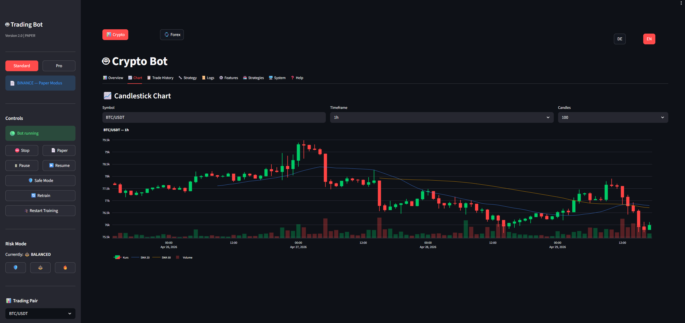

# AlphaForge — AI Trading Bot

[](https://github.com/sponsors/reimgun)
[](https://ko-fi.com/reimgun)
[](LICENSE)

**🇬🇧 English** &nbsp;|&nbsp; **🇩🇪 [Deutsch](README.de.md)**



Fully autonomous AI trading bot for **Crypto, Forex and Equities**.  
Supports 10+ crypto exchanges (Binance, Bybit, OKX, Kraken, Coinbase...) and Forex brokers (IG, OANDA, Alpaca, IBKR).

> **No exchange account needed to start.** The bot begins in **Paper Mode** — it trades with virtual money and shows you what it would have done. You only switch to real money when you're ready (and the performance looks good).

---

### Where Should the Bot Run?

| I want to... | Right installation |
|---|---|
| 💻 Try the bot **on my Mac** | [→ Mac](docs/en/INSTALL.md#-mac--linux) |
| 🐧 Try the bot **on my Linux PC** | [→ Linux](docs/en/INSTALL.md#-mac--linux) |
| 🪟 Try the bot **on my Windows PC** | [→ Windows](docs/en/INSTALL.md#-windows) |
| 🥧 Run the bot **on a Raspberry Pi** | [→ Raspberry Pi](docs/en/INSTALL.md#-raspberry-pi-arm) |
| 📦 Run the bot **24/7 on my QNAP NAS** | [→ QNAP NAS](docs/en/QNAP.md) |
| ☁️ Run the bot **cheaply in the cloud** (Hetzner/DO) | [→ Cloud/VPS](docs/en/CLOUD.md) |
| 🟠 Run the bot **on AWS EC2** | [→ AWS](docs/en/CLOUD.md#aws-ec2) |
| 🔵 Run the bot **on Azure** | [→ Azure](docs/en/CLOUD.md#azure-vm) |

---

### Quick Start (Mac/Linux — one command)

```bash
bash install.sh
```

The setup wizard asks for your exchange, starting capital, risk profile, and optional Telegram alerts — then starts the bot automatically.

### Quick Start (Windows)

**Option A — Double-click (recommended):**  
Double-click **`install.bat`** in the project folder.

**Option B — PowerShell (native, no WSL2 needed):**
```powershell
.\install.ps1
```

### Quick Start (Docker / VPS / Cloud)

```bash
cp .env.example .env && nano .env   # Set DOMAIN + credentials
docker compose -f docker-compose.cloud.yml up -d
```

---

### How the Bot Works

```
Every hour (configurable):
  1. Load market data (Crypto: CCXT / Forex: Broker API)
  2. Calculate 50+ indicators + on-chain data
  3. AI model analyzes market regime (Bull/Bear/Sideways/High-Volatility)
  4. Combine ML confidence + news sentiment + Fear & Greed
  5. Signal: BUY / SELL / HOLD
  6. On buy: set stop-loss + take-profit automatically (bracket order)
  7. Monitor position, trail stop upward
  8. Telegram notification on every trade
```

---

### Features

| Area | What's included |
|---|---|
| **Exchanges** | 10 Crypto exchanges via CCXT · Binance, Bybit, OKX, Kraken, Coinbase, Gate.io, KuCoin, Bitget, HTX, MEXC |
| **Brokers** | IG, OANDA, Alpaca (stocks + crypto), IBKR, Capital.com |
| **AI & ML** | XGBoost + LightGBM · LSTM · RL Agent · Anomaly detection · On-chain data · Groq LLM news sentiment |
| **Market Analysis** | 4 Regimes · Multi-Timeframe · 50+ Indicators · Fear & Greed · Walk-Forward Backtest (Crypto + Forex) |
| **Risk** | ATR Sizing · Trailing Stop · Bracket Orders (OCO) · Circuit Breaker · Black Swan Guard · Correlation Guard |
| **Strategy** | Pluggable IStrategy interface · 2 built-in strategies · Custom strategies · Funding Rate Arbitrage |
| **Execution** | TWAP for orders $10k+ · Slippage tracking · Venue Optimizer (fee-aware routing) |
| **Multi-Bot** | Signal Bus (File + Redis) · Pub/Sub between Crypto and Forex bot |
| **Dashboard** | Streamlit Web UI · Standard/Pro mode · Feature toggles · Strategy selector · Marketplace |
| **Alerts** | Telegram · Discord · HTTP Webhook (Grafana/PagerDuty/n8n) · 12 control commands |
| **Setup** | Hardware benchmark + auto-config · Setup wizard · `make upgrade` (backup + DB migration) |
| **Deployment** | Docker · QNAP NAS · Raspberry Pi ARM · Cloud (Hetzner/DO/AWS/Azure) with HTTPS |
| **Tax** | FIFO Trade Journal · German format (Elster) · Austrian format · CSV export (`make tax-export`) |
| **Reliability** | Dead Man's Switch · Heartbeat · Rate-limit monitoring · Live State Reconciliation |

---

### Setup Wizard

On first start, the wizard guides you through everything:

```
Step 1: Choose exchange or broker   [Binance / Bybit / OKX / Alpaca / OANDA ...]
Step 2: Enter API key               [with link to guide for each exchange]
Step 3: Trading mode                [Paper (recommended) or Live]
Step 4: Starting capital            [virtual or real]
Step 5: Risk profile                [Conservative / Balanced / Aggressive]
Step 6: Set up Telegram alerts      [optional]
→ Hardware benchmark runs auto      [adjusts feature flags to your hardware]
→ AI model is trained               [~3-5 minutes]
→ Bot starts + first Telegram msg
```

---

### Open the Web Dashboard

```bash
make crypto-api       # Terminal 1 — API backend (port 8000)
make crypto-dashboard # Terminal 2 — Streamlit UI (port 8501)
```

Then in browser: **http://localhost:8501**

Dashboard tabs: Overview · Trades · **Strategy** · Logs · Features · Marketplace · System · Help  
Pro mode adds: Performance · Strategy Performance · Risk & Market · AI Explainability

---

### All Commands

```bash
make help                   # All commands with description
make crypto-start           # Start Crypto bot locally
make crypto-train           # Train ML model
make crypto-backtest        # AI-pipeline backtest
make crypto-deploy QNAP=admin@YOUR_QNAP_IP   # Deploy to QNAP
make forex-start            # Start Forex bot locally
make forex-deploy QNAP=admin@YOUR_QNAP_IP   # Deploy Forex to QNAP
make arm-build              # Build Raspberry Pi ARM64 image
make arm-deploy             # Deploy to Raspberry Pi
```

---

### Documentation

| Document | Content |
|---|---|
| [📖 Installation Guide](docs/en/INSTALL.md) | Step-by-step for all platforms |
| [☁️ Cloud & VPS Deployment](docs/en/CLOUD.md) | AWS, Azure, Hetzner, DigitalOcean |
| [⚙️ Configuration](docs/en/CONFIG.md) | All settings explained |
| [📊 Dashboard](docs/en/DASHBOARD.md) | Web dashboard guide |
| [📱 Telegram](docs/en/TELEGRAM.md) | Push notifications & commands |
| [🐳 Docker](docs/en/DOCKER.md) | Production deployment with Docker |
| [📦 QNAP NAS](docs/en/QNAP.md) | 24/7 operation on QNAP NAS |
| [🧠 Strategy](docs/en/STRATEGY.md) | How the bot makes decisions |
| [💱 Forex Bot](docs/en/FOREX.md) | Forex bot — OANDA, Alpaca, economic calendar |
| [🔧 Setup](docs/en/SETUP.md) | Advanced setup options |
| [❓ FAQ](docs/en/FAQ.md) | Common questions & troubleshooting |
